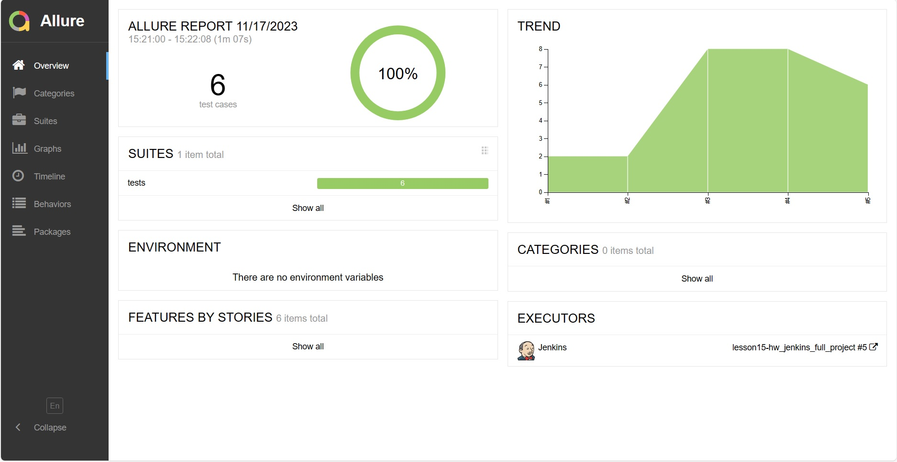
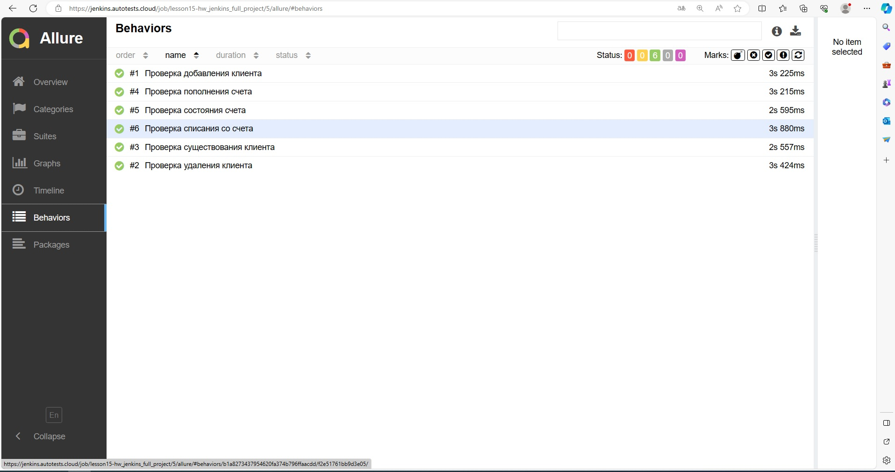
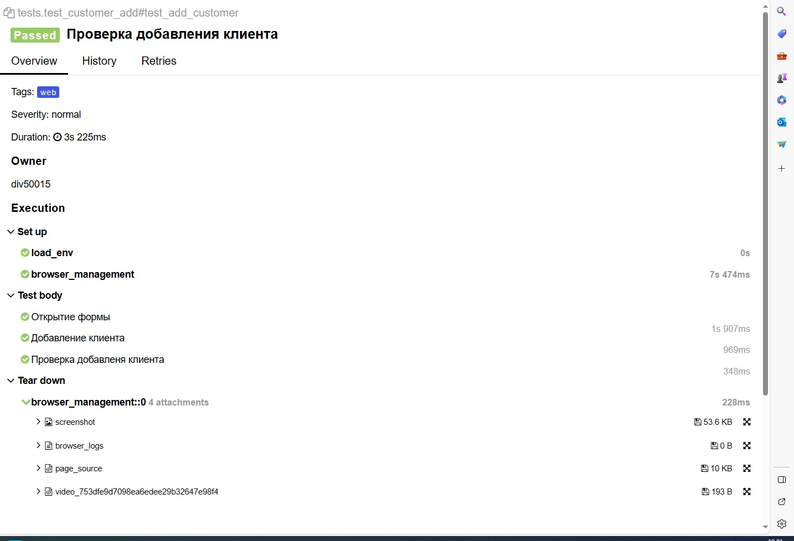
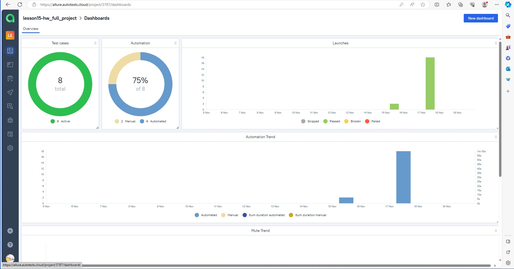
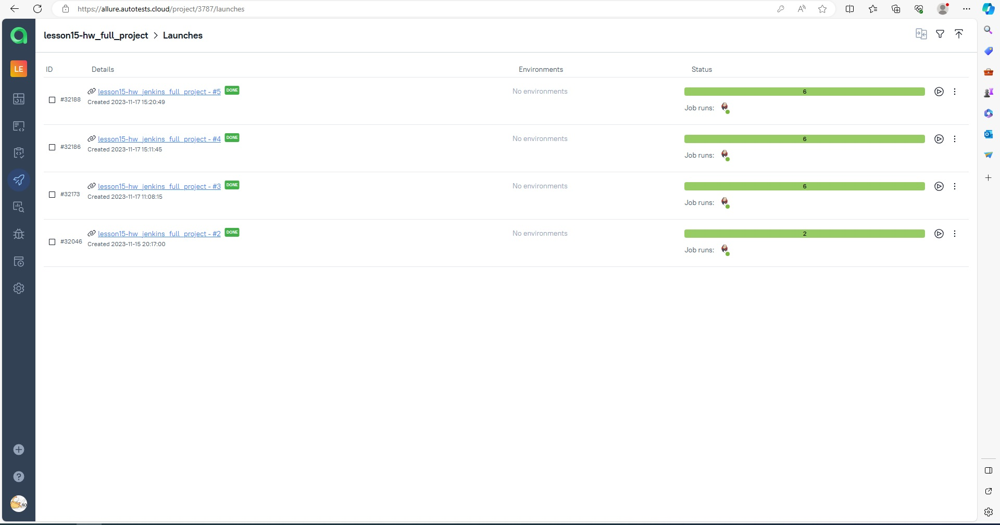
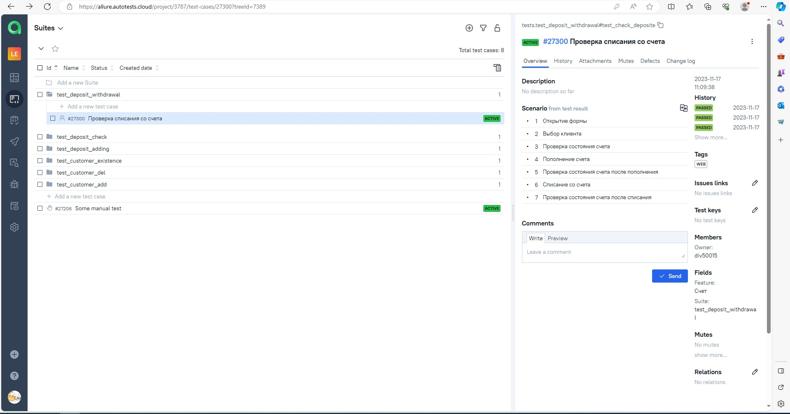
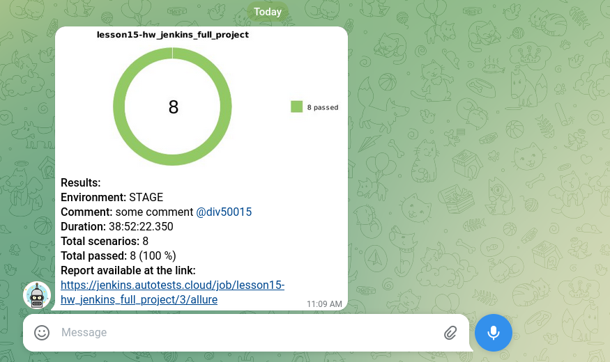
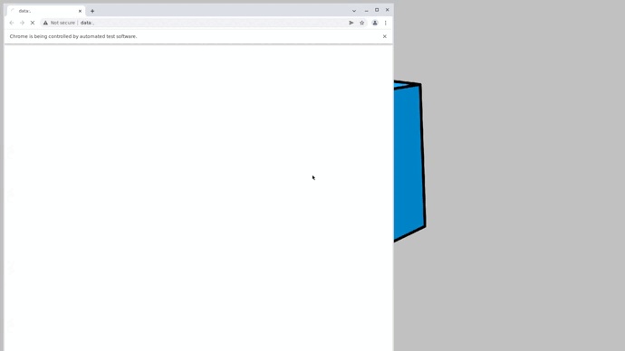

# Проект по тестированию учебной формы BankingProject сайта "www.globalqa.com"
> <a target="_blank" href="https://www.globalsqa.com/angularJs-protractor/BankingProject/#/login">ссылка на форму</a>


----

### Список проверок, реализованных в автотестах

- [x] Поис клиента в списке
- [x] Добавление нового клиента
- [x] Удаление клиента 
- [x] Проверка депозита клиента
- [x] Пополнение депозита клиента
- [x] Списание депозита клиента

----

### Используемый стэк

        

----

### Локальный запуск автотестов

#### Выполнить в cli:
> [!NOTE]
> Ключ выбора версии `--browser-version` не обязателен
```bash
python -m venv .venv
source .venv/bin/activate
pip install -r requirements.txt
pytest . --browser-version=100
```

#### Получение отчёта:
```bash
allure serve build/allure-results
```

----

### Проект в Jenkins
> <a target="_blank" href="https://jenkins.autotests.cloud/job/lesson15-hw_jenkins_full_project//">Ссылка</a>

#### Параметры сборки


* environment - параметр определяет окружение для запуска тестов
* comment - комментарий


#### Запуск автотестов в Jenkins
1. Открыть <a target="_blank" href="https://jenkins.autotests.cloud/job/lesson15-hw_jenkins_full_project//">проект</a>
2. Нажать "Build with Parameters"
3. Из списка "ENVIRONMENT" выбрать: PROD
4. В поле "COMMENT" ввести комментарий
5. Нажать "Build"

----

### Allure отчет
#### Общие результаты



#### Список тест кейсов



#### Отчет прохождения теста




----

### Интеграция с Allure TestOps
> <a target="_blank" href="https://allure.autotests.cloud/project/3787/dashboards">Ссылка на проект</a>

#### Дашборд с общими показателями тестовых прогонов



#### История запуска тестовых наборов



#### Тест кейсы



----


### Оповещения в Telegram



----

### Видео прохождения автотеста



----

